# GKE-Deployment-GitOps

### Сопровождение развертывания при помощи технологий GitOps и Google Cloud Build

----

> Данный гайд является дополнением к [предыдущему гайду](https://github.com/DarkReduX/Kubernetes-WorkStart-GUIDE/blob/gke-deployment-tutorial-guide/README_RU.md) связанному с развертыванием kubernetes в GKE

----

## Структура

>GitOps оператор - отвечает за синхронизацию состояния из Git в Kubernetes. Для этого он периодически (или по событию, которое может быть запущено, например, через webhook):
>* считывает состояние из Git,
>* считывает состояние из Kubernetes,
>* сравнивает их,
>* меняет состояние Kubernetes (если это необходимо).
>
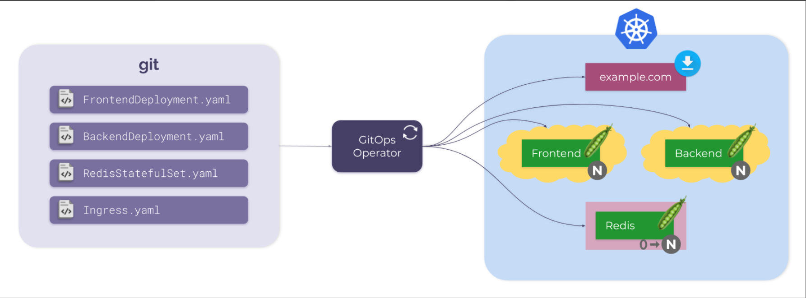

Проще некуда :)

----

## Интеграция GitOps в GKE

Начнем с того что нам необходимо перейти в раздел [Google Cloud Build](https://console.cloud.google.com/cloud-build/builds). \
И выбрать раздел ***Triggers*** где мы создадим триггеры которые будут срабатывать при выполнении условия на github репозитории(можно также привязать и BitBucket) \
Нажимаем сверху на ***CONNECT REPOSITORY*** и выполняем 4 простых действия:
>* Выбираем ресурс
>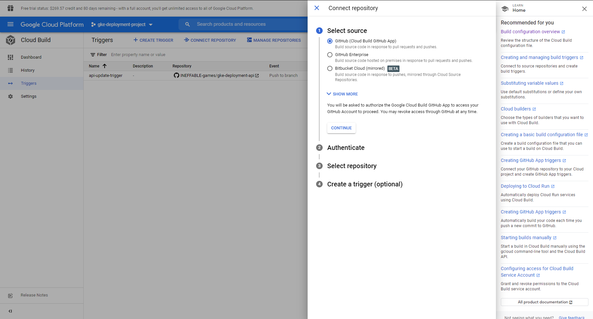
>* Входим в аккаунт GitHub 
>* Выбираем нужные репозитории
>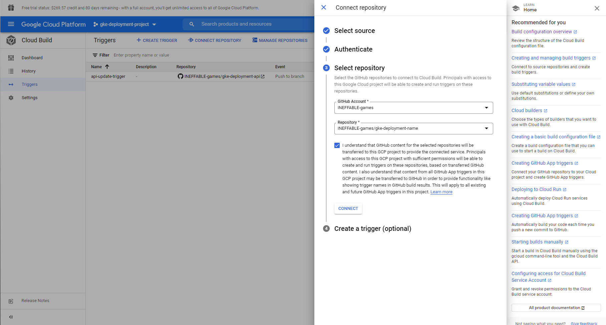
>* Нажимаем ***CREATE A TRIGGER***

Теперь настроим триггер:

> Name - название триггера 
> 
> Description - описание (опционально) 
> 
> Tags - тэги триггера (опционально) 
> 
> Events - событие при котором сработает триггер 
> 
> Source - ресурс (будет заполнен по умолчанию) 
> 
> Branch - ветка для прослушки ивента (по умолчанию ^master$)
> 
> Configuration - конфигурация построения образа
> 
> Location - откуда он будет брать конфигурацию (по дефолту Repository)
> 
> ImageName - важное поле, от него зависит что мы будем далее указывать в deployment.yml а также по какому пути образ будет фактически хранится так как определяет имя будущего образа.

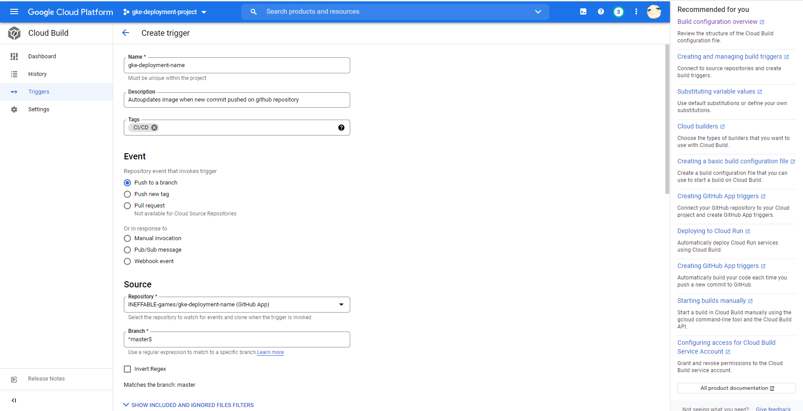
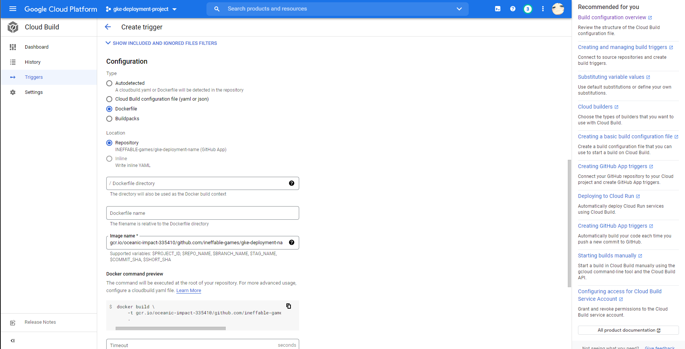
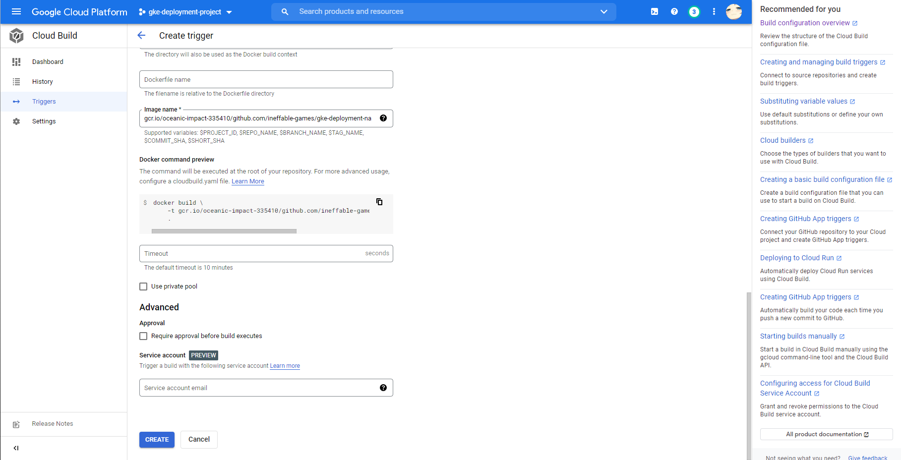

В конце нас ждет долгожданная кнопка ***CREATE***.

Теперь берем наш *ImageName* из настроек триггера и вставляем в конфиги проектов deployment.yml

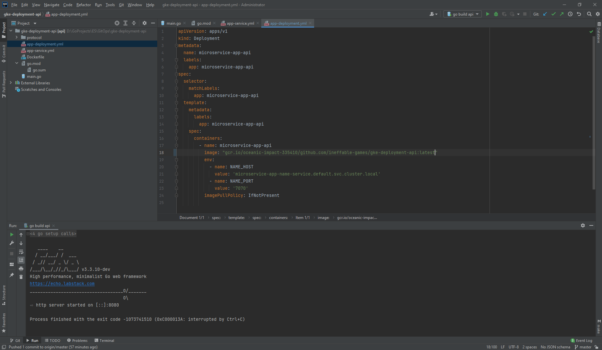

Вот типо этого
>image: "gcr.io/oceanic-impact-335410/github.com/ineffable-games/gke-deployment-api:latest"

Тоже самое проворачиваем и с остальными проектами...

Теперь самое время проверить работоспособность триггера т.к. я изменил deployment.yml а также жоюавил вывод " (GitOps)" и теперь могу запушить изменение на гит. 

В разделе *History* появилась новая запись, триггер работает.

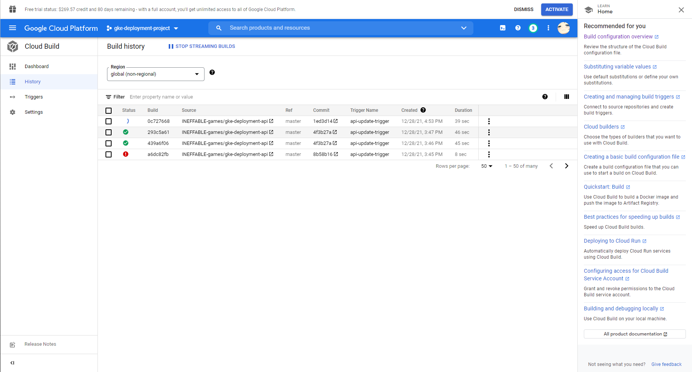

Теперь в разделе ***Container Registry*** появяться наши образы

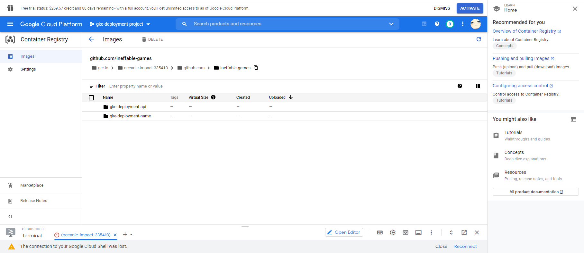

Так как у нас уже имеются запущенные сервисы в ***Workloads*** то нам нужно просто обновить их для этого нажимаем на сервис, ***Actions* // *Rolling update*** \
И в поле ***Container images*** закидываем наш новый путь
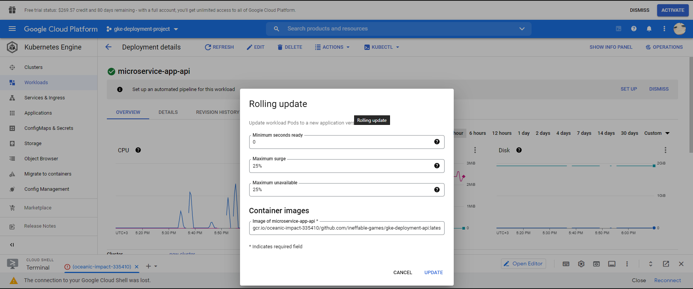

Нажимаем *Update*

Как видим сервисы работают на новых образах которые обновляются триггером при обновлении репозитория на GitHub.
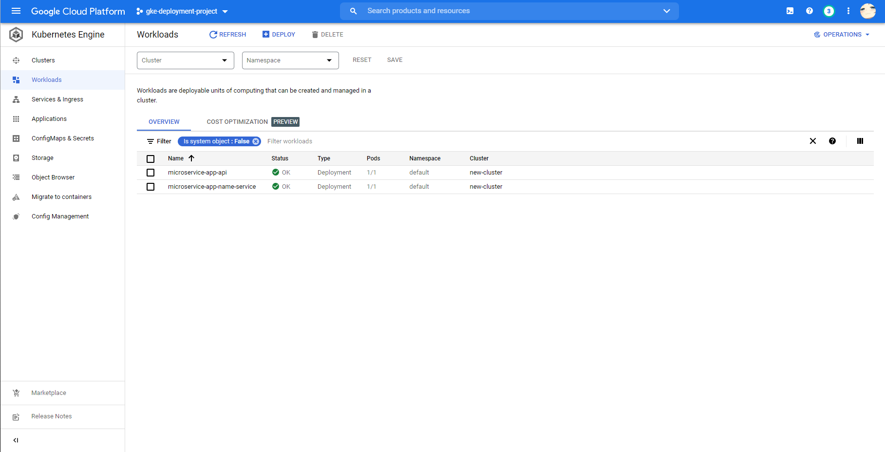

Время тестов вводим либой текст и получаем: 
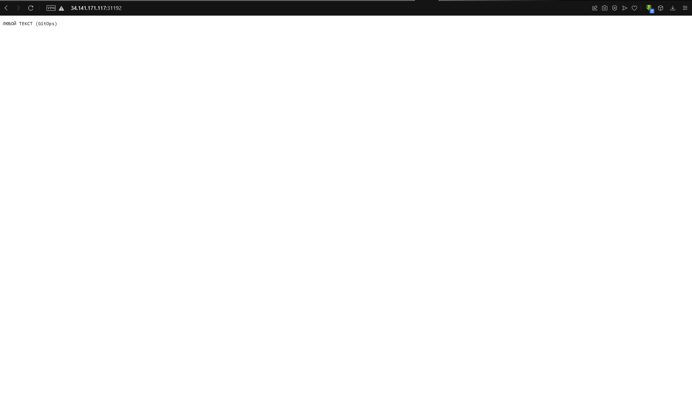

Сервисы работают а надпись "GitOps" в конце сигнализирует о том что данная версия проекта последняя.